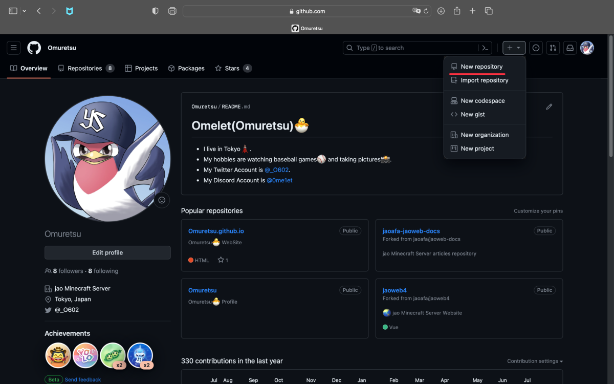
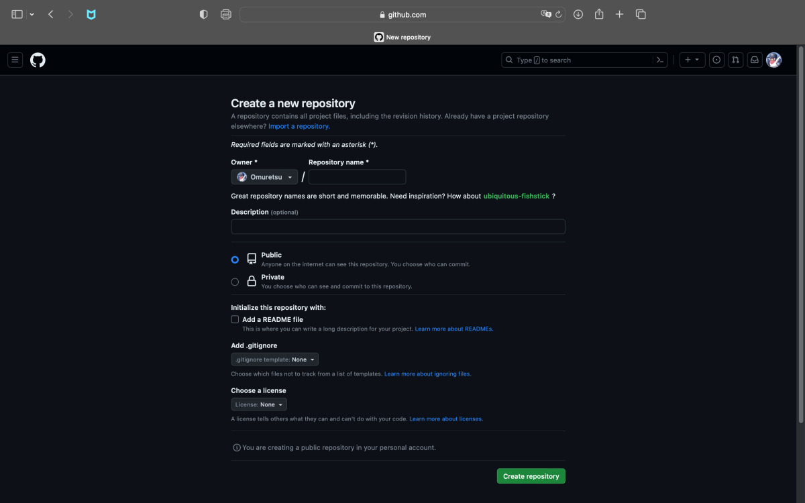
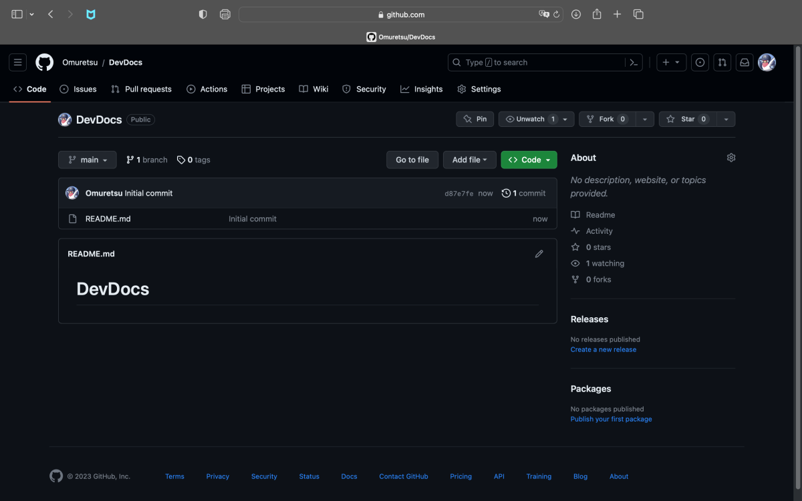

# リポジトリの作り方

## [GitHub の TOP ページ](https://github.com/)を表示し、右上のプラスボタンから"New repository"を選択する

## リポジトリの情報を設定する

- Repository Name

リポジトリの名前

- Description

リポジトリの説明文（任意）

- Public/Private

リポジトリを全世界に向けて公開するかどうかを選択する。  
プライベートリポジトリにする場合は、閲覧者を指定することができる。

- Add a README file

チェックを入れると、`ReadMe.md`を自動生成する。

- Add .gitignore

GitHub にて管理する必要のないファイル群（WordPress のアプリケーションそのものなど）を、Git管理から除外する。

- Choose a license

このリポジトリにて適用するライセンスを設定する。ここでは代表的なモノを列挙する。

| ライセンス名 | 適用 |
| ---- | -------|
| None | 一般の著作権法を適用する。 |
| MIT License | 作成者や著作権者は、製品に対しての義務や責任を何ら負わないこと。 著作権の表示を保持すること。 |
| BSD License (3-clause BSD License) | 作成者や著作権者は、製品に対しての義務や責任を何ら負わないこと。 著作権の表示を保持すること。 派生した製品に、勝手に製品の宣伝または推薦者として組織や貢献者の名前を使用しないこと。 |
| Apache License | 作成者や著作権者は、製品に対しての義務や責任を何ら負わないこと。 著作権と特許権の表示を保持すること。 製品を改変した場合は、その変更点を示すこと。 製品中の特許に対して特許侵害を主張する場合は、その特許ライセンスは終了する。 |
| GNU General Public License (GPL) | 作成者や著作権者は、製品に対しての義務や責任を何ら負わないこと。 著作権の表示を保持すること。 改変、再頒布の前提としてソースコードへのアクセスができること。 製品を改変した場合は、その変更点を示すこと。 製品を改変した場合もGPLで配布すること

参考：[「GitHubでライセンスを設定する」](https://qiita.com/shibukk/items/67ad0a5eda5a94e5c032)

## 完成

